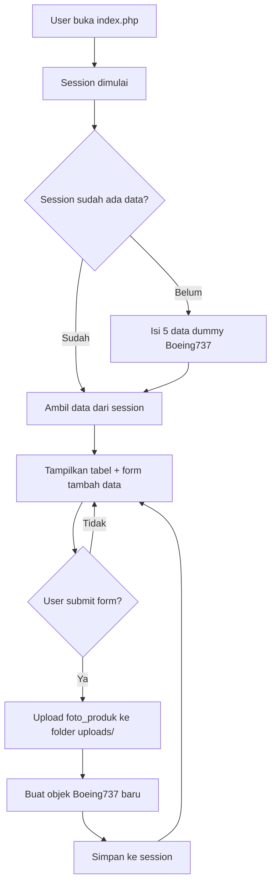
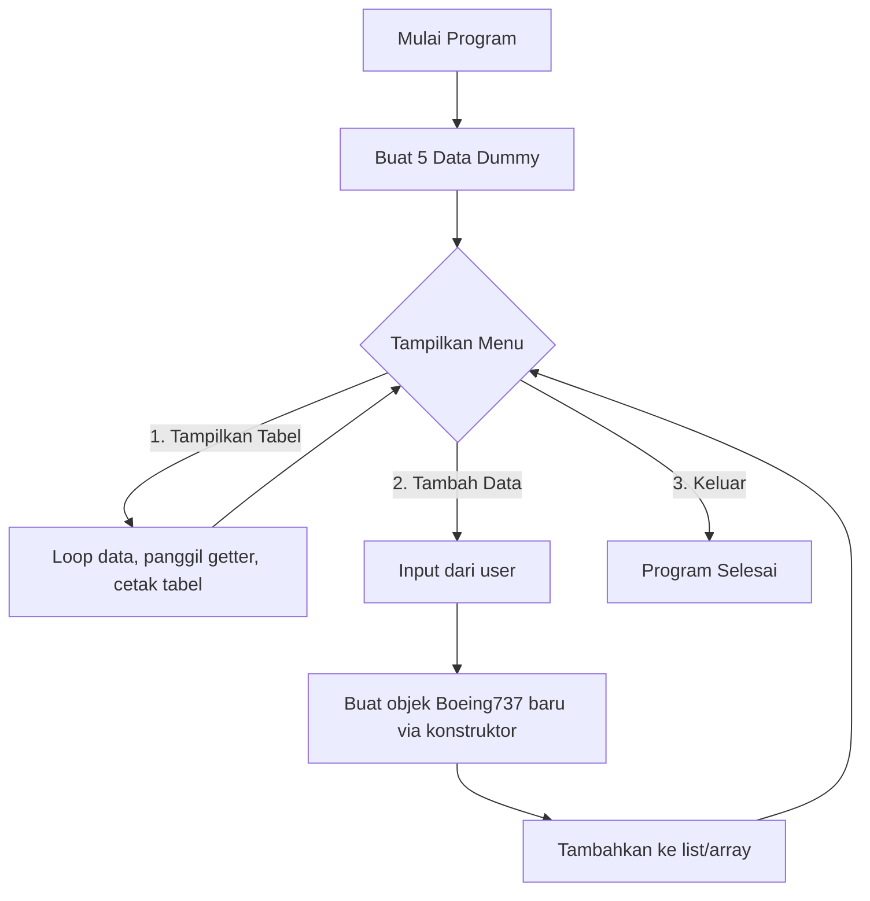

# TP2DPBO2526C2

# ✈️ Sistem Manajemen Pesawat (TP2 DPBO)

Program ini mengelola data pesawat Boeing 737 menggunakan konsep **OOP (Object-Oriented Programming)**: enkapsulasi (private + getter/setter), pewarisan (inheritance) bertingkat, dan konstruktor. Project ini diimplementasikan dalam **4 bahasa**: C++, Java, Python, dan PHP, dengan struktur class yang identik.

## Janji

```
Saya Bentar Bintang Umeir dengan nim 2509865 mengerjakan TP2 dalam mata kuliah DPBO untuk 
keberkahanNya maka saya tidak melakukan kecurangan seperti yang telah dispesifikasikan. Aamiin
```

## 1. Penjelasan Atribut 📖

### 1. `Kendaraan` (Base Class)
| Atribut | Tipe | Keterangan |
|---|---|---|
| `jenisBahanBakar` | String | Jenis bahan bakar yang dipakai kendaraan (mis. "Avtur") |
| `kapasitasPenumpang` | int | Jumlah maksimal penumpang |
| `tahunProduksi` | int | Tahun kendaraan diproduksi |
| `statusMesin` | String | Status mesin saat ini ("Menyala" / "Mati") |

### 2. `Pesawat` (extends `Kendaraan`)
| Atribut | Tipe | Keterangan |
|---|---|---|
| `maskapaiPemilik` | String | Nama maskapai pemilik pesawat |
| `ketinggianMaksimalKaki` | int | Ketinggian jelajah maksimal (dalam kaki) |
| `rutePenerbangan` | String | Rute penerbangan yang dilayani |
| `jumlahMesin` | int | Jumlah mesin pada pesawat |

### 3. `Boeing737` (extends `Pesawat`)
| Atribut | Tipe | Keterangan |
|---|---|---|
| `varianSeri` | String | Varian seri Boeing 737 (mis. "800 NG", "MAX 8") |
| `rentangSayapMeter` | double | Rentang sayap dalam satuan meter |
| `kapasitasKargoKg` | double | Kapasitas kargo dalam kilogram |
| `tipeMesinTurbofan` | String | Tipe mesin turbofan yang digunakan |
| `fotoProduk` *(khusus PHP)* | String | Nama/path file foto pesawat hasil upload |

---

## ⚙️ Penjelasan Methods

Setiap class menerapkan **enkapsulasi**: seluruh atribut bersifat `private`, sehingga hanya bisa diakses dari luar class melalui method berikut.

| Jenis Method | Contoh | Fungsi |
|---|---|---|
| Konstruktor default | `Kendaraan()` | Membuat objek kosong tanpa nilai awal |
| Konstruktor berparameter | `Kendaraan(jenisBahanBakar, ...)` | Membuat objek langsung dengan nilai awal terisi |
| Getter | `getStatusMesin()` | Mengambil nilai atribut private |
| Setter | `setStatusMesin(status)` | Mengubah nilai atribut private dengan validasi/kontrol di satu tempat |

Konstruktor pada class turunan (`Pesawat`, `Boeing737`) selalu memanggil konstruktor kelas induk (`super(...)` di Java/PHP, `Base(...)` di C++, `super().__init__(...)` di Python) sebelum menetapkan atribut miliknya sendiri, sehingga seluruh rantai atribut warisan tetap terisi dengan benar.

---

### Versi Web (PHP)
1. **Session dimulai** (`session_start()`) — dipakai sebagai "database" sementara agar data tidak hilang saat halaman di-refresh.
2. Jika session belum berisi data, program mengisi 5 data dummy `Boeing737` (termasuk `fotoProduk` default).
3. **Halaman ditampilkan** (`index.php`):
   - Menampilkan **tabel data pesawat** beserta foto produknya (diambil lewat `getFotoProduk()`).
   - Menampilkan **form tambah data** dengan input teks + upload gambar (`foto_produk`).
4. Saat form di-submit (`POST`):
   - File gambar yang diupload disimpan ke folder `uploads/` dengan nama unik (`pesawat_<timestamp>.<ekstensi>`).
   - Objek `Boeing737` baru dibuat lewat konstruktor, lalu ditambahkan ke `$_SESSION['databasePesawat']`.
   - Halaman merender ulang tabel dengan data terbaru.



---

## 🧪 Testcase

Setiap bahasa memiliki file `TestCase` yang menguji:
1. Konstruktor default tidak error.
2. Konstruktor berparameter mengisi seluruh atribut (dari level `Kendaraan` sampai `Boeing737`) dengan benar melalui getter.
3. Setter berhasil mengubah nilai atribut.
4. *(Python & PHP)* Atribut private benar-benar tidak bisa diakses langsung dari luar class.

Cara menjalankan:

| Bahasa | Perintah |
|---|---|
| C++ | `g++ -std=c++17 TestCase.cpp -o test && ./test` |
| Java | `javac Kendaraan.java Pesawat.java Boeing737.java TestCase.java && java TestCase` |
| Python | `python3 test_pesawat.py` |
| PHP | `php TestCase.php` |

---

## 🛠️ Cara Menjalankan Program Utama

| Bahasa | Perintah |
|---|---|
| C++ | `c++ Main.cpp -o a.exe && a.exe` |
| Java | `javac *.java && java Main` |
| Python | `python Main.py` |
| PHP | Jalankan web server (mis. `http://localhost/`) lalu buka `index.php` di browser |

## 2. Diagram 


   ## Alasan pemilihan class
   ```
   Alasan Pemilihan & Perbaikan Pewarisan (Inheritance)
   Dalam OOP, inheritance wajib memenuhi aturan "IS-A" (adalah sebuah).
   
   Mengapa Kendaraan lebih baik dari Transportasi? Kendaraan merujuk pada wujud fisik benda/mesinnya (objek konkret), sedangkan Transportasi
lebih merujuk pada sistem atau sektornya (abstrak).
   
   Mengapa bukan Garuda di akhir? Garuda adalah nama perusahaan/maskapai penerbangan (entitas pemilik), bukan jenis pesawat. Menyebut "Garuda adalah sebuah Pesawat" (Garuda IS-A Pesawat)
menyalahi logika OOP. Sebaliknya, "Boeing 737 adalah sebuah Pesawat" sangat tepat secara hierarki. Maskapai (seperti Garuda) lebih cocok dijadikan salah satu atribut di dalam class Pesawat.
   ```
## 3. Alur Program (Program Flow) 🔄

### Versi Console (C++, Java, Python)
1. **Inisialisasi** — program membuat 5 data dummy `Boeing737` dan menyimpannya ke dalam list/array (`ArrayList`, `vector`, `list`).
2. **Menu utama** ditampilkan berulang (`while` loop) dengan 3 pilihan:
   - **1. Tampilkan Tabel** → melakukan iterasi ke seluruh data, memanggil getter masing-masing objek, lalu mencetaknya dalam format tabel rapi.
   - **2. Tambah Data** → program meminta input dari user (maskapai, rute, seri, tahun, penumpang, status mesin), lalu membuat objek `Boeing737` baru melalui konstruktor berparameter dan menambahkannya ke list.
   - **3. Keluar** → menghentikan loop dan program selesai.
3. Program terus berjalan sampai user memilih menu **Keluar**.



## 4. Struktur File 
```
TP2DPBO2526C2/
├── Cpp/
│ ├── Kendaraan.cpp # deklarasi + implementasi class Kendaraan
│ ├── Pesawat.cpp # deklarasi + implementasi class Pesawat
│ ├── Boeing737.cpp # deklarasi + implementasi class Boeing737
│ ├── Main.cpp # program utama (menu interaktif)
│ └── TestCase.cpp # testcase getter/setter & konstruktor
├── Java/
│ ├── Kendaraan.java
│ ├── Pesawat.java
│ ├── Boeing737.java
│ ├── Main.java
│ └── TestCase.java
├── Php/
│ ├── Kendaraan.php
│ ├── Pesawat.php
│ ├── Boeing737.php
│ ├── index.php # program utama (form web + tabel)
│ ├── TestCase.php
│ └── uploads/ # folder penyimpanan foto_produk hasil upload
└── Python/
│   ├── Kendaraan.py
│   ├── Pesawat.py
│   ├── Boeing737.py
│   └── Main.py
└── test_pesawat.py
```

## 5. Dokumentasi
```
Bahasa C++
   1. Compile dan isi tabel sebelum ditambah data
```
   
   
```
   2. Menambahkan data
```
   
   
```
   3. Setelah ditambahkan data
```
   


```
Bahasa Java
   1. Compile dan isi tabel sebelum ditambah data
```
   
   
```
   2. Menambahkan data
```
   
   
```
   3. Setelah ditambahkan data
```
   


```
Bahasa Python
   1. Compile dan isi tabel sebelum ditambah data
```
   
   
```
   2. Menambahkan data
```
   
   
```
   3. Setelah ditambahkan data
```
   


```
Bahasa Php
   1. Menjalankan di local host xampp dan isi tabel sebelum ditambahkan data
```
   
   
```
   2. Tabel setelah ditambahkan data
```
   


   


